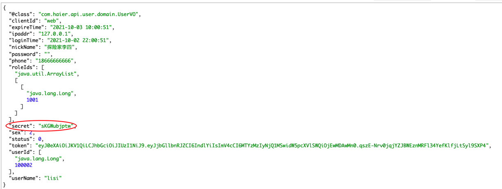
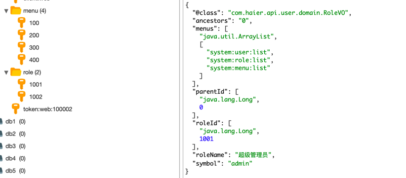
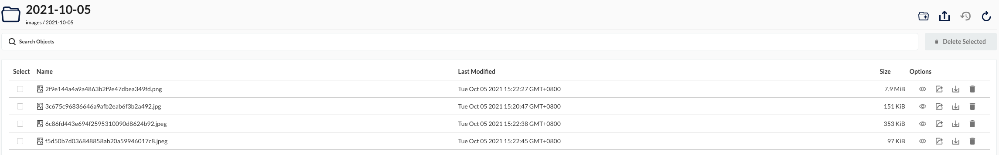

``自己的脚手架``

开始时间：2021年09月12日

## 推荐VUE视频连接
``https://www.bilibili.com/video/BV1Zy4y1K7SH``

保姆级的讲解，我感觉我又行了

## 开发日记

- **2021年09月24日 登录接口完成，JWT格式，分组和加密盐随机生成**
- **2021年09月26日 集成logstash将日志打入ES中**
- **2021年10月02日 集成Rest High Level Client 简单实现查询并输出数据**
- **2021年10月05日 集成MinIO完成文件上传(模拟OSS)(8.3.0版本集成失败，改为了8.2.1)**
- **TODO 2021年10月15日 继承HandlerMethodReturnValueHandler 返回统一格式**
- **TODO 2021年10月25日 PreAuthorize Aspect权限校验**
- **2021年10月12日 集成mybatis-plus简化xml的sql编写**
- **TODO 2021年10月30日 集成validate校验request参数**

##思路
登录：用户登录后，生成的token是jwt格式，secret是动态生成的

每次登录的人都会获得一个唯一的动态的secret，这个secret是解析token的信息的

并且当前登录的信息仅仅关联roleIds，每次获取个人权限时动态从缓存中查询最新的。role和menu的信息是单独查询缓存的，这样可以在修改role和menu的关系，只需要单独更新角色和菜单信息，不需要更新每个已登录人的信息，

访问请求在gateway处的AuthFilter校验登录信息，通过PreAuthorize注解和Aspect校验菜单信息

Minio （最好集成8.2.1以下，8.3.0集成失败）

访问路径：http://ip:9000/images/2021-10-05/3c675c96836646a9afb2eab6f3b2a492.jpg

2021年10月12日，通过su-sunday-vue实现注册接口了，vue还在学习中